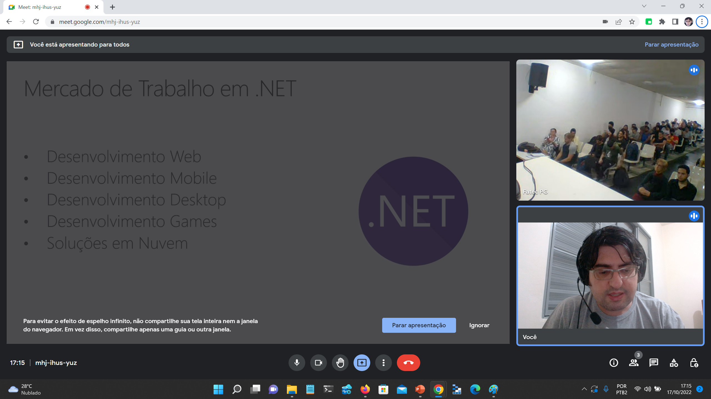

# Talk-EvolucaoDotNet-FatecPraiaGrande2022
Informações (fotos + prints + slides + repositório) sobre **apresentação abordando a evolução da plataforma .NET** e que realizei em evento online - Semana de Tecnologia - para alunos da **Fatec de Praia Grande-SP** no dia **17/10/2022 (segunda-feira)**.

Título da Apresentação: **.NET: Passado, Presente, Futuro, Mercado de Trabalho...**

Tecnologias utilizadas: **.NET, C#, ASP.NET Core, Blazor, MAUI, Visual Studio, Visual Studio Code, Microsoft Azure**

Número de participantes: **55 pessoas**

Deixo aqui meus agradecimentos à **Profa. Simone Viana** por todo o apoio para que eu partipasse como palestrante deste evento.

